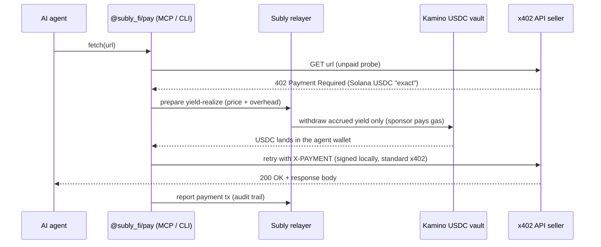

# Subly

> **Use Now, Pay Never.** Your yield pays your AI agent's API bills.

[](https://github.com/SublyFi/subly-payment-protocol/actions/workflows/ci.yml)
[](https://www.npmjs.com/package/@subly_fi/pay)
[](LICENSE)
[](package.json)
[](https://x402.org)
[](https://solana.com)

Subly lets an AI agent pay for [x402](https://x402.org)-metered APIs from the **yield** on a one-time USDC deposit, instead of spending the deposit itself. You deposit USDC once into a [Kamino](https://kamino.finance) vault on Solana. When your agent hits an HTTP `402 Payment Required` paywall, Subly checks the accrued yield, realizes just enough of it into the agent's wallet, and pays the seller with a completely standard x402 USDC payment.

- **Sellers need no Subly integration.** They receive an ordinary x402 payment through their own facilitator (PayAI, Coinbase CDP, ...).
- **Principal is protected by a server-side guard.** Payments are funded only from spendable yield; the deposit stays in the vault earning.
- **Non-custodial.** Transactions are signed locally with your own Solana keypair (or your Circle / Privy custody wallet). Subly never holds your key.
- **No SOL needed.** A sponsor wallet fronts all network fees; the agent wallet only ever holds USDC.
- **Human-in-the-loop spending controls.** An owner-signed spending mandate sets caps, escalation thresholds, and a kill switch for the agent.

```text
Existing standard x402 seller
  -> Buyer/agent receives 402
  -> Subly checks spendable Kamino yield
  -> Subly realizes yield into the agent wallet
  -> Buyer pays the seller with standard x402
```

As a rule of thumb: 1,000 USDC at 10% APY covers roughly 27 API calls per day at $0.01 each (before overhead).

---

## Table of contents

- [Why Subly?](#why-subly)
- [How it works](#how-it-works)
- [Quick start](#quick-start)
- [Using Subly from Claude (MCP)](#using-subly-from-claude-mcp)
- [CLI reference](#cli-reference)
- [Client configuration](#client-configuration)
- [Spending controls (owner mandate)](#spending-controls-owner-mandate)
- [Self-hosting the relayer](#self-hosting-the-relayer)
- [Architecture](#architecture)
- [Security & trust model](#security--trust-model)
- [Known limitations](#known-limitations)
- [Development](#development)
- [Roadmap](#roadmap)
- [Documentation](#documentation)
- [Contributing](#contributing)
- [License](#license)
- [Disclaimer](#disclaimer)

## Why Subly?

**Autonomous payments, manual top-ups.** AI agents are getting genuinely good at metered, pay-per-call work — market data, on-chain analytics, research APIs priced at $0.01–$0.05 per call over x402. But their funding model is still a human refilling a wallet. When the wallet runs dry, the agent stops.

Subly replaces the top-up loop with an endowment model: deposit once, and the deposit's yield becomes a self-refilling API budget. The agent spends the interest; the principal is not spent on API calls.

## How it works



Throughout this document, the **relayer** is Subly's buyer-side server (the vault / budget / yield-realize API) — it is *not* the seller's x402 facilitator; sellers keep their own.

1. **Deposit.** The agent wallet deposits USDC into the Subly vault on Kamino. The relayer records the *principal basis*.
2. **Yield accrues.** Vault share value grows against the basis; the difference is *spendable yield*.
3. **402 challenge.** The agent calls a paid API without an API key and receives a standard x402 challenge. Subly selects the `scheme=exact` / `network=solana` / `asset=USDC` requirement.
4. **Yield realize.** The relayer prepares a withdrawal capped to spendable yield (`purpose: "yield_realize"`) — a server-side guard rejects anything that would dip into principal. The sponsor pays gas.
5. **Standard x402 payment.** The client signs the USDC payment locally (via the official `@x402/svm` + `@x402/fetch`) and retries the request. The seller returns the data.
6. **Audit.** The payment transaction signature is reported back and bound to the realize, giving a per-payment spending log.

The realize and the payment are two separate transactions (deliberately — composite vault-withdraw+pay transactions don't pass external facilitators' policies), so the flow is standard-compatible rather than atomic.

## Quick start

**Prerequisites:** Node.js >= 20, the [Solana CLI](https://docs.anza.xyz/cli/install) (for `solana-keygen`), and some USDC on Solana mainnet. You do **not** need SOL, an API token, or a pre-registration — wallets self-register with signature auth on first use.

### 1. Create an agent wallet

Subly never creates or holds wallets — bring your own keypair:

```bash
mkdir -p ~/.subly
solana-keygen new --no-bip39-passphrase -o ~/.subly/agent.json
export SUBLY_DEMO_AGENT_KEYPAIR_PATH=~/.subly/agent.json
```

(Prefer a custody wallet? See [Circle / Privy signers](#custody-signers-circle--privy).)

### 2. Fund it with USDC

Send USDC (Solana mainnet) to the printed address. No SOL — every transaction fee is sponsored.

### 3. Deposit into the yield vault

Amounts are **raw USDC units** (6 decimals): `1 USDC = 1_000_000`. The vault minimum is just over 1 USDC (exactly `1000000` is refused by share rounding — use `1010000` or more):

```bash
npx -y @subly_fi/pay deposit 1010000   # 1.01 USDC
```

The first deposit auto-registers your wallet with the relayer. If the relayer requires owner setup first, the command prints instructions to create a one-time [setup link](#spending-controls-owner-mandate) (`pay setup-link --initial-deposit ...`). On the hosted beta relayer today the first deposit proceeds without owner setup, because mandate enforcement there still runs in `warn` mode — see [Spending controls](#spending-controls-owner-mandate).

### 4. Pay an x402 API from yield

```bash
npx -y @subly_fi/pay fetch https://seller.example.com/api/premium
```

That's it. If the accrued yield doesn't cover the price yet, you'll get `insufficient_yield` — that's expected early on; yield accrues over time.

> Works with any standard x402 seller that offers a **Solana USDC `exact`** rail with facilitator `extra.feePayer` support (meaning the seller side sponsors the payment transaction's network fee — true of common facilitators such as PayAI and Coinbase CDP). Examples: the pay-per-call crypto-data APIs (Nansen, CoinGecko, Birdeye, ...) priced at $0.01–$0.05 per request.
>
> The client refuses to pay more than **0.01 USDC per call by default** — for pricier sellers, raise `SUBLY_MCP_MAX_AMOUNT_RAW_USDC` or pass the `maxAmountRawUsdc` argument, or you'll see `amount_exceeds_client_cap`.

## Using Subly from Claude (MCP)

The same package ships a stdio MCP server (`subly-payments`) so agents can manage the whole lifecycle — setup, deposit, budget check, payment, withdrawal — as tools.

**Claude Code:**

```bash
claude mcp add subly -- npx -y @subly_fi/pay mcp
```

**Claude Desktop** (`~/Library/Application Support/Claude/claude_desktop_config.json` on macOS, `%APPDATA%\Claude\claude_desktop_config.json` on Windows):

```json
{
  "mcpServers": {
    "subly": {
      "command": "npx",
      "args": ["-y", "@subly_fi/pay", "mcp"],
      "env": {
        "SUBLY_DEMO_AGENT_KEYPAIR_PATH": "/Users/you/.subly/agent.json"
      }
    }
  }
}
```

Claude Desktop does not inherit your shell environment: put every variable in the `env` block, use an **absolute** keypair path (`~` is not expanded), and if Node is installed via nvm set `command` to the absolute path from `which npx`. Restart the app fully after editing.

### MCP tools

| Tool | What it does |
| --- | --- |
| `create_subly_setup_link` | Creates a one-time owner setup link (spending mandate + pre-approved first deposit — one Face ID covers both). |
| `check_subly_setup` | Polls a setup session (`pending` / `completed` / `expired`). |
| `deposit_to_subly_vault` | Deposits USDC into the vault (gas sponsored). |
| `get_subly_yield_budget` | Reports principal basis, position value, gross yield, and spendable yield. |
| `fetch_with_subly_payment` | Fetches a URL; on a 402 it realizes yield and pays via standard x402. |
| `withdraw_from_subly_vault` | Exit path — withdraws back to the agent wallet (may spend principal; instant liquidity only). |

> **Tip:** in Claude Code, the tool-permission prompt *is* your payment confirmation. Don't set `fetch_with_subly_payment` to always-allow unless you fully trust the mandate caps.

## CLI reference

All subcommands run via `npx -y @subly_fi/pay <cmd>` (the bin is named `pay`).

| Command | Description |
| --- | --- |
| `pay mcp` | Start the stdio MCP server (all config via env vars). |
| `pay fetch <url> [maxAmountRawUsdc] [apr_<id>]` | One-shot paid fetch. Optional per-call price cap and owner-approval id for retries. |
| `pay deposit <amountRawUsdc> [apr_<id>]` | Deposit into the vault. |
| `pay withdraw <amountRawUsdc> [apr_<id>]` | Withdraw back to the agent wallet (exit path — may spend principal). |
| `pay setup-link [--initial-deposit N] [--approval-threshold N] [--per-payment-cap N] [--daily-api-cap N] [--daily-deposit-cap N] [--ttl-days D]` | Create a one-time owner setup link (10-minute expiry, single-use). |
| `pay setup-status <st_sessionId \| setupUrl>` | Check a setup session (public read, no key needed). |

Examples:

```bash
# Pay a POST-body x402 seller
SUBLY_PAY_METHOD=POST SUBLY_PAY_BODY='{"q":"..."}' \
  npx -y @subly_fi/pay fetch https://seller.example.com/api/query

# A payment above the approval threshold was refused with an approveUrl —
# after the owner approves, retry the SAME url with the SAME cap plus the approval id:
npx -y @subly_fi/pay fetch "https://seller.example.com/api/premium" 2000000 apr_1a2b3c

# Exit: withdraw 1 USDC
npx -y @subly_fi/pay withdraw 1000000
```

On an `approval_required` response **nothing has been paid** — the JSON includes an `approveUrl` for the owner and the exact retry command.

## Client configuration

All configuration is via environment variables (there are no config files and no API tokens — requests are authenticated by wallet signature).

| Variable | Default | Description |
| --- | --- | --- |
| `SUBLY_DEMO_AGENT_KEYPAIR_PATH` | — | Path to a `solana-keygen` JSON keypair (required with the default `local` signer). |
| `SUBLY_DEMO_AGENT_KEYPAIR` | — | Alternative: base58-encoded 64-byte secret key (checked before the path). |
| `SUBLY_SIGNER_PROVIDER` | `local` | `local` \| `circle` \| `privy`. |
| `SUBLY_RELAYER_URL` | `https://api.demo.sublyfi.com` | Relayer base URL. Point this at your own relayer when [self-hosting](#self-hosting-the-relayer). (`SUBLY_FACILITATOR_URL` is a legacy alias.) |
| `SOLANA_RPC_URL` | `https://api.mainnet-beta.solana.com` | RPC used for lookup tables and building the x402 payment. |
| `SUBLY_MCP_MAX_AMOUNT_RAW_USDC` | `10000` (0.01 USDC) | Client-side per-payment cap for `pay mcp` and `pay fetch`. |
| `SUBLY_MCP_STATE_PATH` | `~/.subly/standard-x402-pending.json` | Local store of pending payments (double-payment protection). |
| `SUBLY_PAY_METHOD` / `SUBLY_PAY_BODY` | `GET` / — | `pay fetch` only: HTTP method / JSON body for POST-body sellers. |

### Custody signers (Circle / Privy)

Instead of a local keypair, the agent wallet can be a custody wallet. Every returned signature is verified locally against the wallet key and the exact transaction bytes before use.

```bash
# Circle developer-controlled wallet (LIVE credentials; sandbox = devnet is rejected)
export SUBLY_SIGNER_PROVIDER=circle
export CIRCLE_API_KEY=... CIRCLE_ENTITY_SECRET=... CIRCLE_WALLET_ID=...

# Privy server wallet
export SUBLY_SIGNER_PROVIDER=privy
export PRIVY_APP_ID=... PRIVY_APP_SECRET=... PRIVY_WALLET_ID=...
export PRIVY_AUTHORIZATION_KEY=wallet-auth:...   # only for owner-key/agentic wallets
```

Each variable also accepts a `SUBLY_`-prefixed form (e.g. `SUBLY_CIRCLE_API_KEY`) that takes precedence, so Subly can use different credentials than other tooling on the same machine.

## Spending controls (owner mandate)

Subly separates the **agent** (holds the wallet key, spends yield) from the **owner** (a human who authorizes policy). The owner signs a *spending mandate* — with a passkey (Face ID) or an ed25519 wallet signature — that the relayer applies. The defaults below describe the policy as enforced when the relayer runs with enforcement `on` (see the boundary note underneath):

| Policy | Default | Meaning |
| --- | --- | --- |
| Approval threshold | 1 USDC | Payments at or below run automatically; above requires owner approval. |
| Per-payment cap | 10 USDC | Absolute ceiling — even owner approval cannot exceed it. |
| Daily API spend cap | 100 USDC | Rolling 24h cap on realized spend. |
| Daily deposit cap | 3,000 USDC | Rolling 24h cap on deposits. |
| Deposit policy | owner approval required | Principal never enters DeFi without a human sign-off. |
| Withdrawal policy | agent allowed | Exiting risk is never gated by default (can be locked to owner approval). |
| Payee allowlist | off | Optional allowlist of seller addresses. |

- **Setup links** bundle mandate signing with a pre-approved first deposit, so onboarding is a single Face ID tap. Links expire in 10 minutes and are single-use; the pre-approved deposit id is valid ~15 minutes.
- **Approvals** are single-use, bound to the exact payment (payee + amount + resource), and expire in 15 minutes. The agent surfaces an `approveUrl` the owner opens on their phone.
- **Kill switch:** the owner can revoke the mandate at any time; revocation blocks all spending immediately. A 72-hour agent-initiated recovery-revoke exists for owner-loss deadlock (the owner can veto during the window).
- **Audit:** `GET /v1/wallets/:wallet/spending-log` gives one row per payment with the decision (`auto_within_policy` / `owner_approved:apr_...`) and the mandate hash.

**Honest boundary:** these controls are enforced at the relayer, not by an on-chain program — and the enforcement level is env-staged via `SUBLY_MANDATE_ENFORCEMENT=off|warn|on` (**default `warn`**: violations are logged and stamped on the intent but not blocked; only the owner kill switch always blocks). **The hosted beta relayer currently also runs `warn`** — treat the caps above as advisory there until it is switched to `on`. Self-hosters should set it to `on` for real enforcement. See [`docs/spending-mandate-design.md`](docs/spending-mandate-design.md).

## Self-hosting the relayer

The relayer is the buyer-side vault/budget/yield-realize API in [`src/`](src). It is **not** an x402 facilitator — sellers keep their own. By default the npm client talks to Subly's hosted beta relayer (`api.demo.sublyfi.com`); everything it does can be self-hosted.

### Local development

```bash
git clone https://github.com/SublyFi/subly-payment-protocol.git
cd subly-payment-protocol
npm ci
npm run dev        # http://localhost:3000, NODE_ENV=development
```

With no chain configuration, dev boots in **detached mode** (in-memory ledger, no on-chain operations) — enough to exercise the API surface and mandate endpoints. For full mainnet mode set `SOLANA_RPC_URL` + `SUBLY_SPONSOR_KEYPAIR_PATH` (see below). `NODE_ENV` is fail-closed: anything other than `development`/`test` counts as production and refuses to boot without the required env.

### Production (Docker Compose)

`deploy/` ships a production stack: Postgres 16 + the relayer (built from the root [`Dockerfile`](Dockerfile), Node 24) + Caddy with automatic TLS.

```bash
cd deploy
cp relayer.production.env.example relayer.production.env   # fill in
cp Caddyfile.example Caddyfile                             # set your domain
mkdir -p secrets                                           # sponsor keypair -> secrets/sponsor.json
echo "POSTGRES_PASSWORD=$(openssl rand -hex 24)" > .env
docker compose up -d --build
curl -s https://<your-domain>/healthz                      # {"ok":true}
```

There is no migration step — the Postgres schema auto-creates on first connection. Full instructions (updates via `git archive`, monitoring cron): [`deploy/README.md`](deploy/README.md).

### Key server environment

| Variable | Required (prod) | Description |
| --- | --- | --- |
| `SOLANA_RPC_URL` | yes — boot refuses without it | A dedicated/paid RPC (public RPC is not sufficient). |
| `SUBLY_SPONSOR_KEYPAIR_PATH` / `SUBLY_SPONSOR_KEYPAIR` | yes — boot refuses without it | Sponsor key — co-signs and pays gas for every vault flow. Keep it funded with SOL. |
| `DATABASE_URL` | yes — boot refuses without it | Postgres ledger (positions, intents, mandates, approvals, audit events). |
| `SUBLY_EXTRA_LOOKUP_TABLES` | operational | Settlement address lookup table (create with `scripts/create-settlement-lut.ts`). Boot succeeds without it, but vault transactions can exceed Solana's size limit. |
| `SUBLY_ADMIN_API_TOKEN` | operational | Operator bearer token for `/v1/admin/*` (unset, those endpoints return 503). Buyers need no token. |
| `SUBLY_MANDATE_ENFORCEMENT` | no (default `warn`) | `off` \| `warn` \| `on` — set `on` to actually block policy violations. |
| `SUBLY_TRUST_PROXY` | behind a proxy | Required behind Caddy/LB so per-IP rate limiting keys on the real client IP. |
| `SUBLY_APPROVE_URL_BASE` / `SUBLY_SETUP_URL_BASE` | for mandates | Where owner approve/setup pages are served (WebAuthn rpId derives from these). |
| `SUBLY_ENABLE_LEGACY_X402` | no (default off) | Re-enables the retired seller-side `subly-yield-exact` endpoints. Leave off. |

### Operational scripts

| Script | Purpose |
| --- | --- |
| `scripts/create-settlement-lut.ts` | One-time: create/extend the settlement lookup table (keeps vault transactions under Solana's size limit). |
| `scripts/invest-vault.ts` | Crank idle vault USDC into Kamino reserves so yield actually accrues. |
| `npm run validate:mainnet` | Read-only mainnet validation harness — simulates the full settlement path, moves no funds. |
| `scripts/check-sponsor-balance.sh` | Cron monitor: alerts a webhook when the sponsor's SOL drops below threshold. |
| `scripts/onboard-agent.sh` | Operator-only manual wallet recovery (normal users self-register). |

## Architecture

```text
+--------------+   MCP / CLI    +------------------+   wallet-signature auth   +-----------------+
|   AI agent   | -------------> |  @subly_fi/pay   | ------------------------> |  Subly relayer  |
| (Claude ...) |                |  packages/pay    |      prepare / submit     |  src/ (Fastify) |
+--------------+                |  signs locally   |                           +--------+--------+
                                +--------+---------+                   sponsor co-signs |
                                         | standard x402                                |
                                         v (@x402/svm)                                  v
                                +------------------+                          +------------------+
                                |  x402 seller +   |                          |  Kamino USDC     |
                                |  its facilitator |                          |  vault (Solana)  |
                                +------------------+                          +------------------+
```

- **[`packages/pay`](packages/pay)** — the published client (`@subly_fi/pay`): MCP server, CLI, local/custody signing, standard x402 payer built on the official `@x402/svm` + `@x402/fetch` (handles off-curve/PDA seller addresses). MIT-licensed, `npx`-runnable.
- **[`src/`](src)** — the relayer: Fastify API with wallet-signature auth (`x-subly-wallet` / `x-subly-signed-at` / `x-subly-signature` over method + path + body hash, 5-minute freshness). Vault flows are two-step: the server *prepares* a versioned transaction with the sponsor as fee payer, the client validates the structured intent and signs locally, the server co-signs, broadcasts, confirms, and attributes on-chain deltas to the Postgres ledger. Yield-realize withdrawals are checked against the fresh vault exchange rate: *"Yield-realize withdrawals are limited to the spendable yield; the deposited principal is never spent."*
- **[`demo/`](demo)** — runnable deposit/withdraw clients (`npm run demo:deposit -- <raw>`), plus legacy `subly-yield-exact` demos kept for history (`demo:legacy:*`).
- **[`deploy/`](deploy)** — production Docker Compose stack.
- **[`docs/`](docs)** — design documents ([index](docs/README.md); several are written in Japanese).
- **[`tests/`](tests)** — 28 Vitest suites covering the x402 payer, vault flows, mandates, wallet auth, fee estimation, and more.

## Security & trust model

What you trust, and what you don't:

- **Keys:** never leave your machine (local signer) or your custody provider (Circle/Privy — signatures are verified locally before use). The relayer cannot move funds without the agent's signature on the exact prepared transaction, which the client validates against a structured intent before signing.
- **The relayer** maintains the ledger, enforces the yield-only guard and mandate policy, and sponsors gas. A malicious relayer could refuse service or mis-report budgets, but cannot sign for your wallet. Enforcement is server-side, not on-chain (an explicit non-goal so far).
- **The vault:** deposits carry real DeFi protocol risk (Kamino). Exits are intentionally never gated: withdrawals are agent-allowed by default and the design treats "never freeze user exits" as a hard rule. See [`docs/protocol-dependency-risk.md`](docs/protocol-dependency-risk.md) for the disclosure/containment/survivability design.
- **Sellers** see a standard x402 USDC payment on-chain. Payments are currently transparent (payer → seller is publicly visible); a third-party-unlinkability design exists but is not implemented ([`docs/payment-privacy-design.md`](docs/payment-privacy-design.md)).
- **This code base has not been externally audited.** Use amounts you can afford to lose.

## Known limitations

- **Solana mainnet only**, and only sellers offering a **Solana USDC `exact`** rail with facilitator `extra.feePayer` support. Base/EVM rails are on the roadmap, not implemented.
- **Yield budgets are small by design.** ~6–10% APY on a $500–$5,000 deposit funds cents per day — a fit for metered $0.01-class APIs, not large bills.
- **Withdrawals consume accrued yield first** — the spendable budget drops by the amount withdrawn and only restarts from zero if you withdraw more than the accrued yield. Every withdrawal also pays the vault's penalty: the greater of 0.01% and a 0.001 USDC floor.
- **`insufficient_yield` is normal** right after depositing — yield needs time to accrue (rough guide: a 100 USDC deposit reaches its first $0.01 payment within hours to about a day, depending on the vault's current APY; each realize must also cover ~0.0035 USDC of penalty + fee overhead).
- **Mandate enforcement defaults to `warn`** on self-hosted relayers — flip `SUBLY_MANDATE_ENFORCEMENT=on` for hard enforcement.
- **Fees:** the protocol charges no payment fees. A performance fee on realized yield is planned for the hosted service ([`docs/business-model.md`](docs/business-model.md)) but is not implemented; self-hosting is entirely fee-free.

## Development

```bash
npm ci
npm test              # 28 Vitest suites (no network/DB needed)
npm run typecheck     # strict TypeScript, includes tests/demo/scripts
npm run build         # server -> dist/
npm run dev           # relayer in watch mode
```

The client package builds separately:

```bash
cd packages/pay
npm run build         # esbuild bundle -> dist/
```

Repository layout: the root package (`subly-agent-payments`) is **private** — the relayer server plus demos and ops scripts. Only [`packages/pay`](packages/pay) is published to npm (see [`packages/pay/PUBLISHING.md`](packages/pay/PUBLISHING.md)).

## Roadmap

- Vault yield optimization and a multi-venue TVL ladder (single-vault today)
- Vault health monitor with automatic deposit/realize halt on anomalies (designed, not implemented — withdrawals are never halted)
- Program security audit
- Additional payment rails (Base, further x402 schemes)
- Additional custody signers (Turnkey, Coinbase CDP, ...)
- Payment privacy via PSP-style omnibus settlement (designed, not implemented)
- Performance-fee collection for the hosted service

## Documentation

| Document | Contents |
| --- | --- |
| [`docs/README.md`](docs/README.md) | Docs index — defines which designs are canonical vs legacy. |
| [`docs/nansen-x402-yield-payment-architecture.md`](docs/nansen-x402-yield-payment-architecture.md) | The canonical buyer-side payment flow, step by step. |
| [`docs/buyer-side-yield-payment-strategy.md`](docs/buyer-side-yield-payment-strategy.md) | Why buyer-side standard x402 (vs. the retired seller-integrated scheme). |
| [`docs/spending-mandate-design.md`](docs/spending-mandate-design.md) | Owner mandate: caps, approvals, passkeys, kill switch. |
| [`docs/protocol-dependency-risk.md`](docs/protocol-dependency-risk.md) | DeFi dependency risk: disclosure, auto-halt, safety reserve design. |
| [`docs/payment-privacy-design.md`](docs/payment-privacy-design.md) | Third-party payment unlinkability design (not implemented). |
| [`packages/pay/README.md`](packages/pay/README.md) | Client package reference (env vars, MCP tools, troubleshooting). |
| [`deploy/README.md`](deploy/README.md) | Production deployment runbook. |

> Note: several design documents are currently written in Japanese; English translations are welcome contributions.

## Contributing

Issues and pull requests are welcome — see [CONTRIBUTING.md](CONTRIBUTING.md) for the development setup and guidelines, and please follow the [Code of Conduct](CODE_OF_CONDUCT.md). Report security vulnerabilities privately per the [Security Policy](SECURITY.md), never in a public issue.

Good first contributions: English translations of the design docs, and additional custody signer transports (one file implementing `RemoteSignerTransport` + an env branch — see [`docs/agent-wallet-providers.md`](docs/agent-wallet-providers.md)).

## License

[MIT](LICENSE) © SublyFi

## Disclaimer

Subly moves real money on Solana mainnet and deposits it into third-party DeFi protocols. **There is no guarantee of principal or yield.** APY varies; DeFi or stablecoin failures can reduce or destroy deposited value; withdrawals can be delayed by vault liquidity. Payments are made at use time from realized yield, and principal is not intentionally spent — but this is a software guarantee enforced off-chain, not an on-chain invariant, and the code has not been audited. Regulatory and tax treatment vary by jurisdiction. Use at your own risk.

---

<p align="center"><b>Subly</b> — Use Now, Pay Never · <a href="https://x.com/subly_fi">@subly_fi</a></p>
