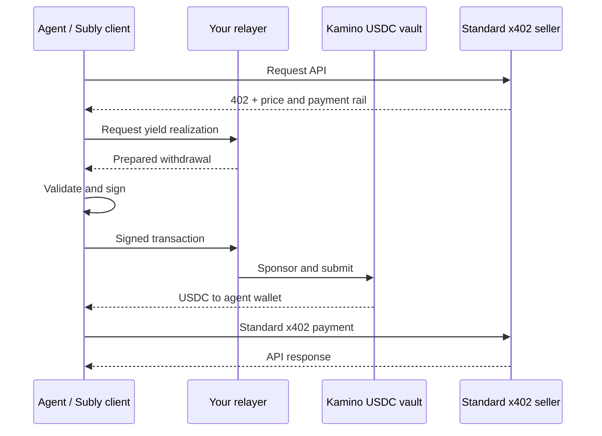

# Subly

**Pay for x402 APIs with the yield from a Kamino USDC vault on Solana.**

[](https://github.com/SublyFi/subly-payment-protocol/actions/workflows/ci.yml)
[](https://www.npmjs.com/package/@subly_fi/pay)
[](LICENSE)

Subly provides an open-source relayer and an MCP/CLI client. An agent deposits USDC into a selected Kamino Earn vault. When an API returns `402 Payment Required`, the client asks the relayer to realize enough accrued yield, then pays the seller using standard x402. Sellers do not need to integrate Subly.

| I want to… | Start here |
| --- | --- |
| Use Subly with an agent or the CLI | [Client quick start](packages/pay/README.md#quick-start) |
| Operate my own relayer | [Operator guide](deploy/README.md) |
| Try the API locally without funds | [Local development](#try-it-locally) |
| Contribute a change | [Contributing](CONTRIBUTING.md) |

**Status:** MIT-licensed OSS, version `0.x` (beta). Mainnet vault operations use real funds. There has been no external security audit. Yield limits and owner mandates are enforced by the relayer; they do not guarantee principal value or prevent an agent with its own key from transacting elsewhere. See the [security model](docs/security-model.md) and [dependency status](docs/dependencies.md).

## What is included

- **Client:** `@subly_fi/pay` exposes setup, deposits, budgets, withdrawals and paid API requests through CLI and stdio MCP.
- **Relayer:** Fastify API with wallet-signature authentication, sponsored vault transactions, owner spending controls and a PostgreSQL ledger.
- **Self-hosting:** Docker Compose with PostgreSQL and Caddy HTTPS; no Subly account, operator allowlist or proprietary service is required.
- **Vault choice:** a reviewed local catalogue of compatible mainnet USDC Kamino Earn vaults, with separate accounting and mandates for each vault.



The relayer and the seller's **x402 facilitator** have different roles. The relayer sponsors vault transactions; the seller's facilitator sponsors the final x402 payment. Realization and payment are separate transactions, so the flow is not atomic.

## Use the client

Install Node.js 24 and choose a relayer operator you trust. No repository clone is needed:

```bash
npx -y @subly_fi/pay@0.7.1 --help
export SUBLY_RELAYER_URL=https://your-relayer.example.com
export SUBLY_DEMO_AGENT_KEYPAIR_PATH=/absolute/path/to/agent.json
npx -y @subly_fi/pay@0.7.1 doctor
```

Continue with the [client guide](packages/pay/README.md): review the vault, create an owner setup link, approve the policy, deposit, and check the budget before buying an API call. It also includes MCP configuration, custody signers and troubleshooting.

Supported sellers must offer **Solana mainnet USDC `exact`** with `extra.feePayer`. The client checks the challenge at runtime; a seller name alone is not proof of compatibility. Amounts use six-decimal raw USDC units: `1000000` means 1 USDC. The default API payment cap is `10000` (0.01 USDC).

## Try it locally

Node.js 24 and npm 11 are the development baseline:

```bash
git clone https://github.com/SublyFi/subly-payment-protocol.git
cd subly-payment-protocol
npm ci
npm run dev
```

In another terminal:

```bash
curl --fail http://127.0.0.1:3000/healthz
curl --fail http://127.0.0.1:3000/v1/vaults
```

With no RPC or sponsor configured, explicit development mode uses an in-memory **detached** API. It requires no wallet, funds or database. On-chain deposit, withdrawal and settlement are unavailable in this mode. Production refuses this fallback.

```bash
npm run check                  # types, tests, build and documentation links
npm ci --prefix packages/pay
npm run check --prefix packages/pay
npm run test:package           # install the tarball and exercise CLI + MCP
```

The [contributor guide](CONTRIBUTING.md) explains PostgreSQL tests and repository structure.

## Operate a relayer

Follow the [operator guide](deploy/README.md) for configuration, sponsor funding, reviewed vault metadata, lookup tables, HTTPS, health checks, backups and upgrades. The deployment is built from a tagged source checkout. Publish your relayer URL and reviewed vault catalogue to your users.

Sponsor gas and account rent are operator costs. Recorded fee debt reduces a user's spending budget; the current code does **not** collect reimbursement for the operator.

## Documentation and community

The [documentation index](docs/README.md) links the current architecture, API, security and troubleshooting guides. Old beta plans, pitch materials and superseded designs are available in Git history rather than the onboarding path.

- [Questions and discussions](https://github.com/SublyFi/subly-payment-protocol/discussions) · [Bug reports](https://github.com/SublyFi/subly-payment-protocol/issues)
- [Security reporting](SECURITY.md) · [Support](SUPPORT.md)
- [Contributing](CONTRIBUTING.md) · [Code of conduct](CODE_OF_CONDUCT.md) · [Governance](GOVERNANCE.md)
- [Changelog](CHANGELOG.md) · [Release process](RELEASE.md) · [MIT license](LICENSE)
